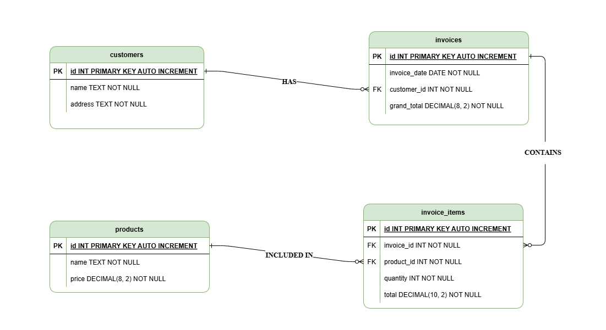

## 🚀 Installation & Setup Guide

Follow these steps to install and run the project locally:

### 1. Clone the Repository

```bash
git clone https://github.com/kareemzayed/Technical-Assignment-MTS.git
cd Technical-Assignment-MTS
```

### 2. Install Dependencies

Make sure you have Composer installed, then run:

```bash
composer install
composer dump-autoload
```

### 3. Import Excel Data

This project includes a custom script to import data from `data.xlsx`. To run the import:

```bash
composer import-excel
```

This will execute the script defined in `composer.json`:

```json
"scripts": {
  "import-excel": "php bin/import-excel data.xlsx",
}
```

### 4. Start the PHP Development Server

Navigate to the project directory (if you're not already in it):

```bash
cd Technical-Assignment-MTS
php -S localhost:8000 -t public
```

The project will now be accessible at `http://localhost:8000`.

### 🌐 Accessing Resources

You can retrieve data from specific tables by passing the `resource` parameter in the URL:

| Resource        | URL Example                                    | Description                  |
| --------------- | ---------------------------------------------- | ---------------------------- |
| `customers`     | [http://localhost:8000?resource=customers]     | Fetches all customer records |
| `products`      | [http://localhost:8000?resource=products]      | Fetches all product records  |
| `invoices`      | [http://localhost:8000?resource=invoices]      | Fetches all invoices         |
| `invoice_items` | [http://localhost:8000?resource=invoice_items] | Fetches all invoice items    |

### ▶️ Running the Tests

You can execute the test suite using the following command:

```bash
composer test
```

This command is defined in `composer.json`:

```json
"scripts": {
  "test": "phpunit --colors=always"
}
```

The details of test configurations in the Test section below.

---

# Solution (design and architecture)

## 📦 Database Migration Architecture & Design

The database schema management in this project is structured using a **modular, interface-driven migration system**. This approach enhances maintainability, testability, and scalability.

### ✅ Design Summary

All migration classes implement a custom interface: `App\Contracts\MigrationInterface` which defines two methods:

```php
public function up(PDO $pdo): void;
public function down(PDO $pdo): void;
```

Each database table (customers, products, invoices, invoice_items) has a corresponding migration class under `App\Database\Migrations`.

A centralized `MigrationRunner` is responsible for applying (up) or reverting (down) all migrations in a transactional manner using PDO.

The migration system is bootstrapped automatically during connection initialization inside the `getConnection()` method that inside the `DatabaseConnection` class.

### 🎯 SOLID Principles in Action

This design adheres to the SOLID principles as follows:

#### 1. S — Single Responsibility Principle

Each class has one clear responsibility:

`MigrationRunner`: Coordinates running/rolling back migrations.
Each `*TableMigration`: Defines the schema for a specific table.

#### 2. O — Open/Closed Principle

The migration system is open for extension (add new migration classes), but closed for modification — the `MigrationRunner` doesn’t need to change when new migrations are added.

#### 3. L — Liskov Substitution Principle

All migration classes can be used interchangeably via the `MigrationInterface`. This abstraction allows consistent handling of all migrations.

#### 4. I — Interface Segregation Principle

The `MigrationInterface` is minimal and focused. It avoids forcing implementing classes to define unused methods.

#### 5. D — Dependency Inversion Principle

`MigrationRunner` depends on the `MigrationInterface` abstraction — not on concrete migration classes. This decouples the runner from specific implementations.

### 🧱 Design Patterns Used

#### Strategy Pattern:

Each migration class acts as a strategy for modifying a specific table’s schema. The `MigrationRunner` executes them without knowing their internals.

#### Dependency Injection:

The `MigrationRunner` receives all migrations via constructor injection, making it easy to control and test.

### 📁 Folder Structure

```
src/
├── Contracts/
│   └── MigrationInterface.php
├── Database/
│   ├── DatabaseConnection.php
│   ├── MigrationRunner.php
│   └── Migrations/
│       ├── CreateCustomersTableMigration.php
│       ├── CreateProductsTableMigration.php
│       ├── CreateInvoicesTableMigration.php
│       └── CreateInvoiceItemsTableMigration.php
```

## 🧩 Database Connection Architecture & Design

To manage database connections cleanly and safely across the application, the project uses a combination of the Factory Pattern and the Singleton Pattern.

This architecture separates concerns between how a PDO instance is created (delegated to a factory) and how a single, lazily-initialized instance is accessed (via the singleton `DatabaseConnection`).

### ✅ Design Summary

#### 🔨 PdoFactory

The `App\Database\PdoFactory` class is a simple, reusable factory responsible for constructing PDO instances with consistent configuration options.

This allows for better testability, reusability, and centralized configuration of PDO options.

#### 🏗️ DatabaseConnection (Singleton)

The `App\Database\DatabaseConnection` class is designed as a singleton, ensuring that only one instance of the database connection exists at any given time.

- A private static property holds the singleton instance.
- The constructor is private, and cloning or unserializing is prevented.
- `init()` initializes the singleton with the path, a PDO factory, and connection options.
- `getInstance()` provides global access to the instance.
- `getConnection()` lazily initializes the PDO connection.

#### 🔄 Automatic Schema Initialization

Inside `getConnection()`, the database schema is automatically initialized. It:

- Ensures the SQLite database directory exists.
- Creates the PDO instance using `PdoFactory`.
- Enables foreign key constraints.
- Executes all migrations using `MigrationRunner`.

This ensures the database is always up to date with the schema when the connection is first used.

### 🎯 How This Follows SOLID Principles

#### Single Responsibility Principle (SRP)

- `PdoFactory` is only responsible for creating PDO instances.
- `DatabaseConnection` handles the lifecycle and singleton access.
- `MigrationRunner` manages database schema setup.

### 🧱 Design Patterns Used

- Singleton Pattern: Guarantees a single `DatabaseConnection` instance across the application.
- Factory Pattern: Encapsulates the PDO creation logic inside `PdoFactory`.

### 🧪 Example Usage

To initialize the database connection:

```php
$databasePath = dirname(__DIR__, 1) . '/database/invoice.sqlite';

DatabaseConnection::init(
    dbPath: $databasePath,
    pdoFactory: new PdoFactory(),
    options: [
        PDO::ATTR_ERRMODE => PDO::ERRMODE_EXCEPTION,
        PDO::ATTR_DEFAULT_FETCH_MODE => PDO::FETCH_ASSOC,
        PDO::ATTR_EMULATE_PREPARES => false,
    ]
);
```

Then, anywhere in the application, you can retrieve the PDO instance via:4

```php
$pdo = DatabaseConnection::getInstance()->getConnection();
```

### 📁 Folder Structure

```
src/
├── Database/
│   ├── PdoFactory.php
│   ├── DatabaseConnection.php
│   ├── MigrationRunner.php
│   └── Migrations/
│       └── ...
```

## 📦 Repository Pattern for Database Actions

To organize all database interactions cleanly and promote separation of concerns, this project uses the Repository Pattern.

### 📋 RepositoryInterface

Defines a consistent contract with essential CRUD methods:

- `all()` — Fetch all records
- `find(int $id)` — Find a record by ID
- `create(array $data)` — Create a new record
- `update(int $id, array $data)` — Update an existing record
- `delete(int $id)` — Delete a record

This standardizes how repositories behave and enables interchangeable implementations.

### 🧱 BaseRepository (Abstract Class)

Provides shared logic for all repositories:

- Holds the PDO connection
- Executes SQL statements safely (execute())
- Handles inserts and returns the last inserted ID (insert())

### 🏷️ Concrete Repositories

Each database table has its own repository class, for example:

- `CustomerRepository`
- `InvoiceRepository`
- `ProductRepository`
- `InvoiceItemRepository`

They:
Extend `BaseRepository`
Implement `RepositoryInterface` to guarantee standard methods

This clear separation improves maintainability and readability.

### ✅ SOLID Principles in Action

- Single Responsibility Principle (SRP):
  Each repository handles only its entity’s data access, while BaseRepository manages shared DB logic.

- Open/Closed Principle (OCP):
  Repositories can be extended with new behaviors without modifying existing code.

- Liskov Substitution Principle (LSP):
  All repositories are interchangeable through the common interface.

- Interface Segregation Principle (ISP):
  Interfaces expose only necessary methods for repository operations.

- Dependency Inversion Principle (DIP):
  Higher-level code depends on the interface, not concrete classes, allowing easier testing and flexibility.

### 🎯 Design Patterns Used

- Repository Pattern:
  Abstracts database access behind a clean interface, decoupling business logic from direct SQL/DB operations.

### 📁 Folder Structure

```
src/
├── Contracts/
│   └── RepositoryInterface.php
│
├── Database/
│   └── Repositories/
│       ├── BaseRepository.php
│       ├── CustomerRepository.php
│       ├── InvoiceRepository.php
│       ├── InvoiceItemRepository.php
│       └── ProductRepository.php
```

## 📥 Excel Data Importer

I implemented an `ExcelDataImporter` service to import spreadsheet data into database efficiently using the Repository Pattern.

### 🔧 Functionality Overview

- Uses Box/Spout to read Excel files.
- Processes and inserts:
  customers
  Products
  Invoices
  Invoice Items
- Ensures no duplicates.
- Automatically handles foreign key relationships.
- Converts Excel dates to proper Y-m-d format.
- Returns a summary of what was imported.

### 🚀 CLI Execution via Composer

I simplified execution by adding this command to composer.json:

```json
"scripts": {
  "import-excel": "php bin/import-excel data.xlsx"
}
```

So now you can just run:

```bash
composer import-excel
```

## 🧩 Script to render the data saved in database to json

✅ `index.php`

- Acts as the front controller.
- Reads a `?resource=...` query parameter from the URL.
- Uses the `ResourceController` to handle the request.
- Returns JSON-formatted data or an error message.

🧑‍✈️ `ResourceController`

- Validates the incoming request.
- Delegates the request to `ResourceMap` to resolve the appropriate repository.
- Calls `.all()` on the repository and returns the data as a response.

🗺️ `ResourceMap`

- Maps resource names like customers, products, etc., to their corresponding repository classes.
- Instantiates the repository using a shared PDO connection.

### ⚙️ How it fits into the architecture:

- Single Responsibility (S in SOLID): Each class has one job — routing, controlling, or mapping.

- Open/Closed Principle (O in SOLID): You can add more resources just by updating the $map without modifying other logic.

- Clean and decoupled: Controllers don’t care about database logic — it’s handled by repositories via the contract (RepositoryInterface).

---

# Entity Relationship Diagram (ERD)



---

## 📦 Database Tables & Relationships

### 1. `customers`

Stores information about customers.

| Field     | Type | Attributes                  |
| --------- | ---- | --------------------------- |
| `id`      | INT  | PRIMARY KEY, AUTO INCREMENT |
| `name`    | TEXT | NOT NULL                    |
| `address` | TEXT | NOT NULL                    |

- **Relationship**: One customer **has many** invoices.

---

### 2. `invoices`

Represents invoices issued to customers.

| Field          | Type          | Attributes                            |
| -------------- | ------------- | ------------------------------------- |
| `id`           | INT           | PRIMARY KEY, AUTO INCREMENT           |
| `invoice_date` | DATE          | NOT NULL                              |
| `customer_id`  | INT           | FOREIGN KEY →`customers.id`, NOT NULL |
| `grand_total`  | DECIMAL(8, 2) | NOT NULL                              |

- **Relationship**:
  - Each invoice **belongs to** one customer.
  - Each invoice **contains many** invoice items.

---

### 3. `products`

Catalog of all products that can be included in invoices.

| Field   | Type          | Attributes                  |
| ------- | ------------- | --------------------------- |
| `id`    | INT           | PRIMARY KEY, AUTO INCREMENT |
| `name`  | TEXT          | NOT NULL                    |
| `price` | DECIMAL(8, 2) | NOT NULL                    |

- **Relationship**: Products are **included in** many invoice items.

---

### 4. `invoice_items`

Line items associated with each invoice.

| Field        | Type           | Attributes                           |
| ------------ | -------------- | ------------------------------------ |
| `id`         | INT            | PRIMARY KEY, AUTO INCREMENT          |
| `invoice_id` | INT            | FOREIGN KEY →`invoices.id`, NOT NULL |
| `product_id` | INT            | FOREIGN KEY →`products.id`, NOT NULL |
| `quantity`   | INT            | NOT NULL                             |
| `total`      | DECIMAL(10, 2) | NOT NULL                             |

- **Relationship**:
  - Each invoice item **belongs to** one invoice.
  - Each invoice item **references** one product.

---

## 🔗 Relationships Summary

- A **Customer** can have multiple **Invoices**.
- An **Invoice** can contain multiple **Invoice Items**.
- An **Invoice Item** refers to a single **Product**.
- Each **Product** can appear in many **Invoice Items**.

---

## 💡 Notes

- The `grand_total` in `invoices` should equal the sum of `total` fields in its associated `invoice_items`.

---

# 🧪 Testing

This project uses **PHPUnit** to test two methods in the application related to creating customers and products.

## ✅ What’s Tested?

Two key repository methods are tested to ensure proper data creation and database integrity:

| Class                | Method     | Purpose                       |
| -------------------- | ---------- | ----------------------------- |
| `CustomerRepository` | `create()` | Creates a new customer record |
| `ProductRepository`  | `create()` | Creates a new product record  |

## 🧾 Test Environment

To prevent interference with `invoice.sqlite` data, a separate SQLite database `test.sqlite` is used for testing.

## 🛠 Test Initialization

The `setUp()` method is used within the PHPUnit test class to:

- Initialize the `test.sqlite` database.
- Ensure tables exist and are ready.
- Truncate the relevant table before each test to maintain a clean state.

## ▶️ Running the Tests

You can execute the test suite using the following command:

```bash
composer test
```

This command is defined in `composer.json`:

```json
"scripts": {
  "test": "phpunit --colors=always"
}
```

Included the `--colors=always` flag to improve the readability and usability of the test output in the terminal.

### ⚙️ PHPUnit Configuration

PHPUnit is configured using the `phpunit.xml` file located in the project root.

### 📁 Test Directory Structure

```
.
└── tests/
├── CustomerRepositoryTest.php
└── ProductRepositoryTest.php
```
